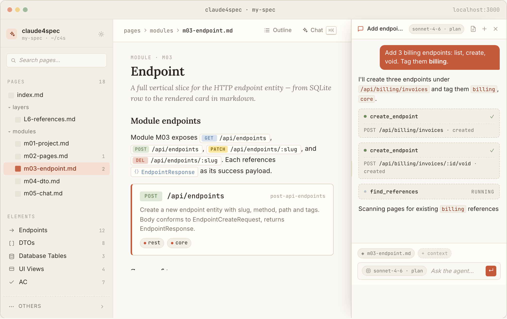

# claude4spec

> Plan the whole system before your agent writes a line of code.

[](https://www.npmjs.com/package/@inharness-ai/claude4spec)
[](https://nodejs.org)
[](./LICENSE)

`claude4spec` is a local-first planning layer for software built with AI agents. You describe the system as structured entities — endpoints, DTOs, tables, acceptance criteria, UI views — with typed relations and version history. Your agent then generates against the plan, not against chat logs.

<picture>
  <source media="(prefers-color-scheme: dark)" srcset="docs/screenshots/hero-dark.png">
  
</picture>

## Why claude4spec

- **Structured plan, not prose.** Endpoints, DTOs, and database tables are first-class records with typed relations, tags, and version history. Your agent queries structure, not paragraphs.
- **The plan survives refactors.** Rename a slug — every reference updates. Edit a section — dependents are flagged stale. Impact is visible before the agent ships code.
- **Local-first.** Your spec is a directory of files in your repo, diff-able in PRs. No SaaS, no telemetry, no vendor lock-in.
- **Agent over MCP.** A built-in MCP server exposes entities to any MCP-aware client — Claude Code, Cursor, Windsurf — alongside the in-app agent.

## Install

```bash
npx @inharness-ai/claude4spec
```

Launches the editor on `http://localhost:3000` and creates a `.claude4spec/` directory (config + SQLite store) in the current working directory.

Global install:

```bash
npm i -g @inharness-ai/claude4spec
claude4spec
```

## Requirements

- Node.js 20+
- `claude` CLI installed and signed in — required only for the in-app agent; the editor, entities, and graph work standalone.
- macOS, Linux, Windows.
- Zero extra cost if you already run Claude Code.

## CLIs

| Command       | Purpose                                                                        |
| ------------- | ------------------------------------------------------------------------------ |
| `claude4spec` | Launch the editor on `http://localhost:3000`.                                  |
| `c4s`         | Read specification entities from the terminal (e.g. `c4s endpoint <slug>`).    |
| `c4s-mcp`     | MCP server exposing entities to MCP-aware clients (Cursor, Windsurf, others).  |

## How it works

Three layers, one mental model:

- **Pages** — plain `.md` files under `pages/`. Git-friendly, editable in any IDE.
- **Entities** — endpoints, DTOs, database tables, acceptance criteria, UI views stored in a single SQLite file with slugs, tags, full-text search, and a timeline of versions.
- **Bridge** — inline XML tags resolve entity slugs into rendered components in the editor and into structured data for the agent. Slug renames propagate across every page automatically.

Example page fragment:

```markdown
## User registration

The frontend calls <inline_mention type="endpoint" slug="create-user"/> with the payload:

<single_element type="dto" slug="CreateUserRequest"/>

The response matches any DTO tagged with `auth`:

<tagged_list type="dto" tags="auth" filter="or"/>
```

## References

Six XML reference types — plain tags in markdown, structured pointers for the agent.

| Type                | When to use                                                |
| ------------------- | ---------------------------------------------------------- |
| `inline_mention`    | A mention inside a prose sentence.                         |
| `single_element`    | A standalone card describing one entity.                   |
| `element_list`      | A hand-picked group of a single type.                      |
| `tagged_list`       | A dynamic, tag-filtered list of one type.                  |
| `tagged_list_mixed` | A multi-type list (endpoints + DTOs) grouped by type.      |
| `section_ref`       | A link to another section with a typed relation.           |

## Claude Code integration

Two skills install with the package:

- **`c4s-spec-reader`** — resolves XML entity tags (`<inline_mention/>`, `<single_element/>`, `<tagged_list/>`) in markdown pages into full entity data.
- **`c4s-brief-implementer`** — implements features described in self-contained briefs from `.claude4spec/briefs/`.

## Architecture

```
┌─────────────────────────────────────────────────────────────────────┐
│                    npx @inharness-ai/claude4spec                    │
│                                                                     │
│   ┌─────────────────┐   ┌─────────────────┐   ┌─────────────────┐   │
│   │    Sidebar      │   │     Editor      │   │      Agent      │   │
│   │  Pages +        │   │  prose +        │   │  in-app +       │   │
│   │  Entities       │   │  entity nodes   │   │  MCP server     │   │
│   └─────────────────┘   └─────────────────┘   └─────────────────┘   │
│            │                    │                      │            │
│            └────────────────────┼──────────────────────┘            │
│                                 │ REST + SSE + WS                   │
│                    ┌────────────▼──────────────┐                    │
│                    │    Local API server       │                    │
│                    └────────────┬──────────────┘                    │
│         ┌───────────────────────┼───────────────────────┐           │
│         │                       │                       │           │
│   ┌─────▼─────┐          ┌──────▼──────┐        ┌───────▼────────┐  │
│   │ Filesystem│          │   SQLite    │        │  Agent runtime │  │
│   │ pages/*.md│          │ entities.db │        │  (claude CLI)  │  │
│   └───────────┘          └─────────────┘        └────────────────┘  │
└─────────────────────────────────────────────────────────────────────┘
```

## FAQ

**How is this different from a general knowledge base?**
A general knowledge base stores prose. `claude4spec` is a planning layer with first-class entities, typed relations, slug-rename propagation, and impact analysis — none of which a prose tool gives you.

**Is it free?**
Yes — MIT-licensed. The in-app agent runs against your existing Claude Code session, so there is zero extra cost if you already run Claude Code. The editor, entities, and graph work without any agent.

**Isn't this just a wrapper around an agent?**
No. The editor, entity store, version history, and reference graph are independent of any agent. The in-app agent is one of several ways to interact — you can use the UI alone, or drive entities from Cursor / Windsurf over MCP.

**Does it support team collaboration?**
Through git — both `pages/*.md` and the SQLite file are committed alongside your code. Realtime collaboration (yjs) is on the roadmap, not in today's release.

**What happens when I rename an entity slug?**
The rename propagates across every `pages/*.md` file via the reference layer. Inline mentions, single-element cards, and hand-picked lists all update.

**How do I uninstall?**
`npx` installs nothing globally. To clean up a project, delete its `.claude4spec/` directory and `pages/`.

## Links

- Homepage: <https://claude4spec.inharness.ai>
- Landing page: [`site/index.html`](./site/index.html)
- Issues: <https://github.com/InHarness/claude4spec/issues>
- Changelog: [`CHANGELOG.md`](./CHANGELOG.md)

## License

MIT — see [LICENSE](./LICENSE).
